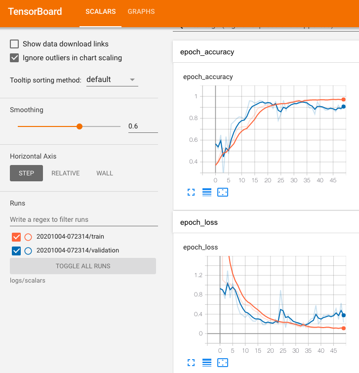

# Magic Wand

- 테스트 디바이스: [Arduino Nano 33 BLE Sense](https://store.arduino.cc/usa/nano-33-ble-sense)

## Demo


## 사전 설치

- Arduino IDE 내 라이브러리 설치
    - Arduino_TensorFlowLite
    - Arduino LSM9DS1 1.1.0
- Arduino LSM9DS1 라이브러리 소스 코드 수정
    - [LSM9DS1.cpp](arduino/Arduino/libraries/Arduino_LSM9DS1/src/LSM9DS1.cpp) 파일 수정:
    ```cpp
    // begin() 끝에 아래 코드 추가
    int LSM9DS1Class::begin()
    {
        ...
        // Enable FIFO
        writeRegister(LSM9DS1_ADDRESS, 0x2E, 0xC0);

        return 1;
    }

    int LSM9DS1Class::accelerationAvailable()
    {
        if (continuousMode) {
            // Read FIFO_SRC. If any of the rightmost 8 bits have a value, there is data.
            if (readRegister(LSM9DS1_ADDRESS, 0x2F) & 63) {
                return 1;
            }
        } else {
            // 주석 처리 후 아래 코드 추가
            /*if (readRegister(LSM9DS1_ADDRESS, LSM9DS1_STATUS_REG) & 0x01) {
                return 1;
            }*/
            if (readRegister(LSM9DS1_ADDRESS, 0x2F) & 63) {
                return 1;
            }
        }

        return 0;
    }
    ```

## 실습 코드

- Chapter 11
    - [Arduino 실습 코드](arduino)
- Chapter 12
    - [Colab 실습](https://github.com/tensorflow/tensorflow/blob/master/tensorflow/lite/micro/examples/magic_wand/train/train_magic_wand_model.ipynb)
    
    
    
    ```bash
    ...
    Epoch 50/50
    1000/1000 [==============================] - 4s 4ms/step - loss: 0.1028 - accuracy: 0.9729 - val_loss: 0.2299 - val_accuracy: 0.9338
    6/6 [==============================] - 0s 4ms/step - loss: 0.2319 - accuracy: 0.9245
    tf.Tensor(
    [[ 75   3   2   2]
    [  0  74   2   8]
    [  1   3  77   7]
    [  0   0   1 129]], shape=(4, 4), dtype=int32)
    Loss 0.23189358413219452, Accuracy 0.9244791865348816
    ...
    Basic model is 20208 bytes
    Quantized model is 9696 bytes
    Difference is 10512 bytes
    ```